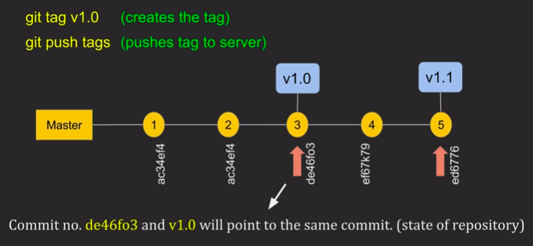

  

### Git Tags

    - Sirve para agregar tags (Etiquetas)

        - Agregar tag
            $ git tag -a v0.1 "Primera version de NC Components React" 83ad9ca

        - Ver tags

            $ git tag

        
        - Ver tags con el hash asignado

            $ git show-ref --tags

        - Push a tags

            $ git push origin --tags

        - Eliminar tags (Localmente)

            $ git tag -d v0.1

        - Eliminar tag (Local & Remoto)

            $ git push origin :refs/tags/v0.1
